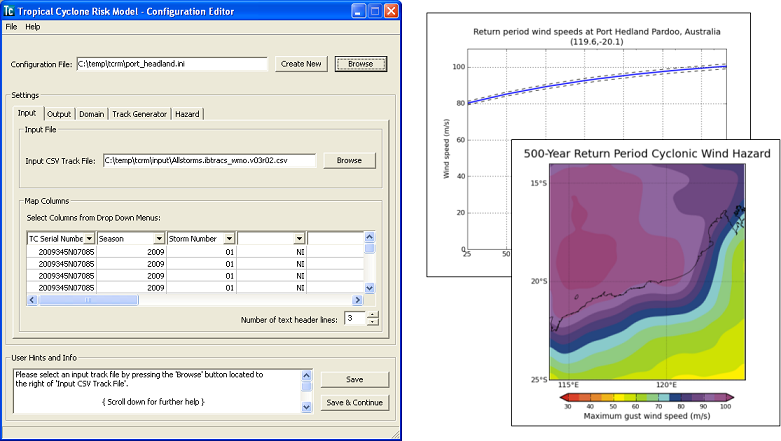

The Tropical Cyclone Risk Model
===============================

The **Tropical Cyclone Risk Model** is a stochastic tropical cyclone
model developed by `Geoscience Australia <http://www.ga.gov.au>`_ for estimating the wind hazard from tropical cyclones.

Due to the relatively short record of quality-controlled, consistent
tropical cyclone observations, it is difficult to estimate average
recurrence interval wind speeds ue to tropical cyclones. To overcome
the restriction of observed data, TCRM uses an autoregressive model to
generate thousands of years of events that are statistically similar
to the historical record. To translate these events to estimated wind
speeds, TCRM applies a parametric windfield and boundary layer model
to each event. Finally an extreme value distribution is fitted to the
aggregated windfields at each grid point in the model domain to
provide ARI wind speed estimates.

Features
========
* **Multi-platform**: TCRM can run on desktop machines through to massively-parallel systems (tested on Windows XP/Vista/7, \*NIX);
* **Multiple options for wind field & boundary layer models**: A number of radial profiles and simple boundary layer models have been included to allow users to test sensitivity to these options.
* **Globally applicable**: Users can set up a domain in any TC basin in the globe. The model is not tuned to any one region of the globe. Rather, the model is designed to draw sufficient information from best-track archives;
* **Evaluation metrics**: Offers capability to run objective evaluation of track model metrics (e.g. landfall rates);
* **Single scenarios**: Users can run a single TC event (e.g. using a b-deck format track file) at high temporal resolution and extract time series data at chosen locations;

Changelog
=========

New features:
-------------

* Added empirical ARI calculation

Bug fixes:
----------

* Correction in landfall decay model for unit conversions

Dependencies
============

TCRM requires:

 * `Python 3.7 <https://www.python.org/>`_;
 * `numpy <http://www.numpy.org/>`_; 
 * `scipy <http://www.scipy.org/>`_;
 * `matplotlib <http://matplotlib.org/>`_; 
 * `Basemap <http://matplotlib.org/basemap/index.html>`_; 
 * `netcdf4-python <https://unidata.github.io/netcdf4-python/netCDF4/index.html>`_; 
 * `cftime <https://unidata.github.io/cftime/>`_;
 * `pandas <http://pandas.pydata.org/>`_; 
 * `Shapely <https://shapely.readthedocs.io/en/latest/manual.html>`_; 
 * `seaborn <https://seaborn.pydata.org/>`_;
 * `statsmodels <http://statsmodels.sourceforge.net>`_;
 * `GitPython <http://gitpython.readthedocs.io>`_;
 * `GDAL/OGR <https://pypi.org/project/GDAL/>`_;
 * `mpi4py <https://mpi4py.readthedocs.io/en/stable/>`_;
 * and `gcc`.  

Status
======

.. image:: https://github.com/GeoscienceAustralia/tcrm/actions/workflows/tcrm-tests.yml/badge.svg?branch=master
    :target: https://github.com/GeoscienceAustralia/tcrm/actions/workflows/tcrm-tests.yml
    :alt: Build status

.. image:: https://coveralls.io/repos/GeoscienceAustralia/tcrm/badge.svg?branch=master
  :target: https://coveralls.io/r/GeoscienceAustralia/tcrm?branch=master
  :alt: Test coverage

    
.. image:: https://landscape.io/github/GeoscienceAustralia/tcrm/master/landscape.svg?style=flat
    :target: https://landscape.io/github/GeoscienceAustralia/tcrm/master
    :alt: Code Health
    
.. image:: https://zenodo.org/badge/10637300.svg
   :target: https://zenodo.org/badge/latestdoi/10637300

Screenshot
==========

Contributing to TCRM
====================

If you would like to take part in TCRM development, take a look at the `Contributing guide <docs/contributing.rst>`_.

License
=======

This repository is licensed under the GNU General Public License. See
the file `LICENSE.rst <LICENSE.rst>`_
for information on the history of this software, terms and conditions
for usage, and a DISCLAIMER OF ALL WARRANTIES.

Contacts
========

Community Safety Branch
Geoscience Australia
hazards@ga.gov.au

